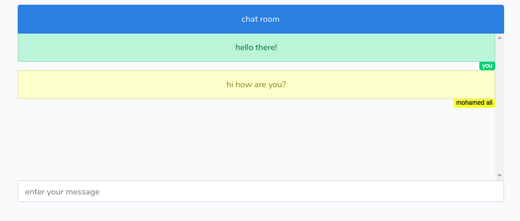

it's a real time chat between users using Laravel, laravel Echo ,vuejs, and pusher.

### installation:
 ```
 
 setup database in .env
 ```
 run in terminal:
 
 ```
 composer install
 
 npm install
 
 php artisan cache:clear
 
 php artisan key:generate
 
 ```



